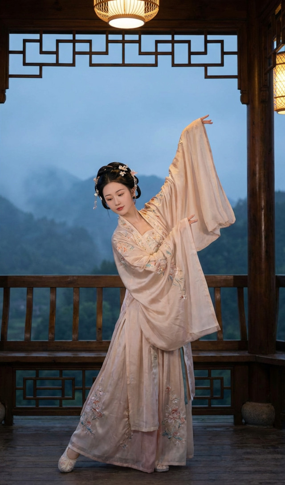
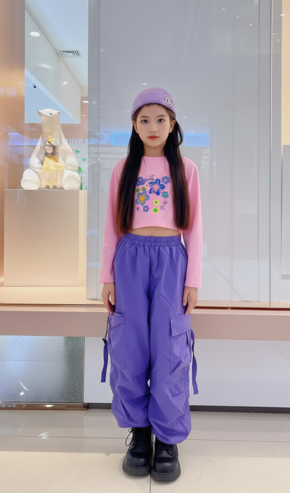
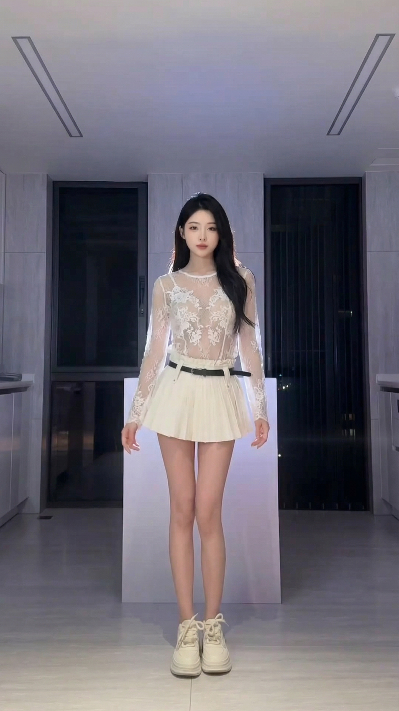
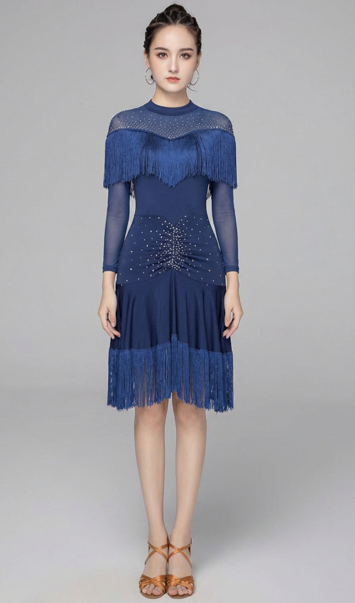
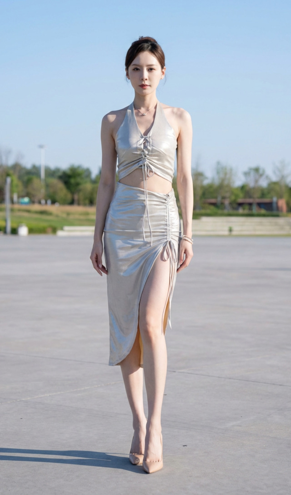

---

# 💃 Wan-Dancer

<p align="center">
    💜 <a href="https://humanaigc.github.io/wan-dancer-project/"><b>Project</b></a> &nbsp&nbsp ｜ &nbsp&nbsp 🖥️ <a href="https://github.com/Wan-Video/Wan-Dancer">GitHub</a> &nbsp&nbsp | &nbsp&nbsp🤖 <a href="https://modelscope.ai/studios/Wan-AI/Wan-Dancer">MS Space</a>&nbsp&nbsp | &nbsp&nbsp🤖 <a href="https://www.modelscope.cn/models/Wan-AI/Wan-Dancer-14B">MS Model</a>&nbsp&nbsp | &nbsp&nbsp🤗 <a href="https://huggingface.co/Wan-AI/Wan-Dancer-14B">HF Model</a>&nbsp&nbsp | &nbsp&nbsp 📑 <a href="https://arxiv.org/abs/2607.09581">Paper</a> &nbsp&nbsp 
<br>

> **Generating long-duration, high-quality, rhythmic dance videos from music with global structure and temporal continuity**

---

## 📄 Abstract

Generating long-duration, high-definition, and rhythmically synchronized dance videos directly from music remains a significant challenge, primarily due to the temporal constraints of current diffusion models, which typically fail beyond 20 seconds. Existing approaches, whether they rely on intermediate 3D skeletons or on end-to-end video synthesis, suffer from temporal drift, identity inconsistency, and repetitive motion patterns when extended to longer horizons. To address these limitations, we propose a novel hierarchical framework for minute-scale coherent music-to-dance generation. Our method decouples the process into global keyframe planning and local temporal refinement, leveraging full-track musical context to ensure long-range coherence. Key innovations include dynamic frame rate adaptation via time-mapped RoPE embeddings for precise alignment, an optical-flow-based loss function to enhance motion continuity, and motion-speed control to preserve high-fidelity details during rapid movements. Extensive experiments demonstrate that our framework surpasses the conventional duration barrier, generating stable, 720p/30fps videos exceeding one minute with superior temporal stability. Furthermore, the model exhibits robust versatility across five distinct dance genres, conditioned on both audio and textual prompts, establishing a new state-of-the-art in coherent, long-form dance video synthesis.

---

## ⚙️ Environment Setup

We tested the code on:

- **OS**: Ubuntu 22.04
- **Hardware**: 8 × NVIDIA A800 80GB GPUs
- **Python**: 3.10.14

### ✅ Install Dependencies

```bash
cd /path/to/Wan-Dancer
python -m venv venv_wan_dancer
source venv_wan_dancer/bin/activate

# Install package in editable mode
pip install -e .

# Install additional and specific versions dependencies
pip install moviepy loguru librosa
pip install https://mirrors.aliyun.com/pytorch-wheels/cu124/torch-2.6.0+cu124-cp310-cp310-linux_x86_64.whl
pip install torchvision==0.21.0
pip install diffusers==0.34.0
pip install yunchang==0.5.0
pip install flash_attn==2.6.3
pip install xfuser==0.4.0
pip install transformers==4.46.2
```

> 💡 Ensure CUDA 12.4 is installed and compatible with your system.

---

## 🚀 Usage Guide

### 1. 🎬 Generate Global Keyframe Video

Run the global stage script:

```bash
cd /path/to/Wan-Dancer
./gen_video_global.sh
```

#### 🔧 Important Parameters

| Parameter              | Description |
|------------------------|-------------|
| `seed`                 | Random seed for reproducibility. |
| `image_path`           | Path to reference image. Example: `gen_video/ref_image/1001.jpg` |
| `prompt_path`          | Path to prompt file (defines dance style).<br>Available styles:<ul><li>Chinese Classic Dance: `gen_video/prompt/古典舞_global.txt`</li><li>K-Pop Dance: `gen_video/prompt/kpop_global.txt`</li><li>Street Dance: `gen_video/prompt/街舞_global.txt`</li><li>Tap Dance: `gen_video/prompt/踢踏舞_global.txt`</li><li>Latin Dance: `gen_video/prompt/拉丁舞_global.txt`</li></ul> |
| `music_path`           | Path to input music file. Example: `gen_video/music/ChineseClassicDance.WAV` |
| `output_folder`        | Output directory for generated video. |
| `timestamp`            | Timestamp identifier for output files. |
| `num_inference_steps`  | Number of diffusion inference steps (e.g., 48). |


#### 🌰 Examples
| Dance Genres | Parameter             | Generated Global Video |
| ------------ |-----------------------|-----------------|
| Chinese Classical Dance | seed=0<br>image_path='gen_video/ref_image/1001.jpg'<br>prompt_path='gen_video/prompt/古典舞_global.txt'<br>music_path='gen_video/music/ChineseClassicDance.WAV'<br>num_inference_steps=48<br>cfg_scale=5 | [](https://cloud.video.taobao.com/vod/mV2fwDpfJ-pODxx6qn-ifq3_UMgbze7P_cI4cLO_vOo.mp4) |
| Street Dance | seed=0<br>image_path='gen_video/ref_image/2001.jpg'<br>prompt_path='gen_video/prompt/街舞_global.txt'<br>music_path='gen_video/music/StreetDance.WAV'<br>num_inference_steps=48<br>cfg_scale=5 | [](https://cloud.video.taobao.com/vod/MQiVGjY_ngH3imgfIl37xaQoJfbWadYldlZoMWJFMKQ.mp4) |
| K-Pop Dance | seed=0<br>image_path='gen_video/ref_image/3001.jpg'<br>prompt_path='gen_video/prompt/kpop_global.txt'<br>music_path='gen_video/music_suno/3001.WAV'<br>num_inference_steps=48<br>cfg_scale=5 | [](https://cloud.video.taobao.com/vod/WGS6Z3VWpgGh8jnt2lrW99XeTB6uu9-H6lCGk1HBLZg.mp4) |
| Latin Dance | seed=0<br>image_path='gen_video/ref_image/4001.jpg'<br>prompt_path='gen_video/prompt/拉丁舞_global.txt'<br>music_path='gen_video/music/LatinDance.WAV'<br>num_inference_steps=48<br>cfg_scale=5 | [](https://cloud.video.taobao.com/vod/jnwCUj3WvuErBAxF78b-kttEJoegA6-8VmLMZsayBGI.mp4) |
| Tap Dance | seed=0<br>image_path='gen_video/ref_image/5001.jpg'<br>prompt_path='gen_video/prompt/踢踏舞_global.txt'<br>music_path='gen_video/music/TapDance.wav'<br>num_inference_steps=48<br>cfg_scale=5 | [](https://cloud.video.taobao.com/vod/lfrYGNMKzYaLvU3IsMyVJM003T5WZL6QKR7xiifEVAg.mp4)|
---

### 2. 🎥 Generate Final High-Resolution Video

Run the local refinement stage:

```bash
cd /path/to/Wan-Dancer
./gen_video_local.sh
```

#### 🔧 Additional Required Parameters

| Parameter             | Description |
|-----------------------|-------------|
| `global_video_path`   | Path to the global video generated in Step 2. **Required** for local refinement. |
| `prompt_path`          | Path to prompt file (defines dance style).<br>Available styles:<ul><li>Chinese Classic Dance: `gen_video/prompt/古典舞_local.txt`</li><li>K-Pop Dance: `gen_video/prompt/kpop_local.txt`</li><li>Street Dance: `gen_video/prompt/街舞_local.txt`</li><li>Tap Dance: `gen_video/prompt/踢踏舞_local.txt`</li><li>Latin Dance: `gen_video/prompt/拉丁舞_local.txt`</li></ul> |

> ✅ All other parameters (`seed`, `image_path`, etc.) are identical to Step 2. 

#### 🌰 Examples
| Dance Genres | Parameter             | Generated Final Video |
| ------------ |-----------------------|-----------------|
| Chinese Classical Dance | seed=0<br>image_path='gen_video/ref_image/1001.jpg'<br>prompt_path='gen_video/prompt/古典舞_local.txt'<br>music_path='gen_video/music/ChineseClassicDance.WAV'<br>num_inference_steps=24<br>cfg_scale=5<br>global_video_path='outputs/global_video/1001_ChineseClassicDance_seed0.mp4' | [](https://cloud.video.taobao.com/vod/UycK9FTbYM6imr_6jF9aYbNYTiBggyE0EYptc2TRIAw.mp4) |
| Street Dance | seed=0<br>image_path='gen_video/ref_image/2001.jpg'<br>prompt_path='gen_video/prompt/街舞_local.txt'<br>music_path='gen_video/music/StreetDance.WAV'<br>num_inference_steps=24<br>cfg_scale=5<br>global_video_path='outputs/global_video/2001_StreetDance_seed0.mp4' | [](https://cloud.video.taobao.com/vod/JZtIncJf7zPptZAYsQsoSxA_tyW_r62JfBBikBiTPcY.mp4) |
| K-Pop Dance | seed=100<br>image_path='gen_video/ref_image/3001.jpg'<br>prompt_path='gen_video/prompt/kpop_local.txt'<br>music_path='gen_video/music_suno/3001.WAV'<br>num_inference_steps=24<br>cfg_scale=5<br>global_video_path='outputs/global_video/3001_KPopDance_seed0.mp4' | [](https://cloud.video.taobao.com/vod/Si5ze8sR0Rm-aPUGSKsTJ2PXJAu3HtnVAzEPM85bkrc.mp4) |
| Latin Dance | seed=0<br>image_path='gen_video/ref_image/4001.jpg'<br>prompt_path='gen_video/prompt/拉丁舞_local.txt'<br>music_path='gen_video/music/LatinDance.WAV'<br>num_inference_steps=24<br>cfg_scale=5<br>global_video_path='outputs/global_video/4001_LatinDance_seed0.mp4' | [](https://cloud.video.taobao.com/vod/kL-0AAqQtigvaidF8Xa8YeTIs4pDLOa_4n5nqXmYiRk.mp4) |
| Tap Dance | seed=0<br>image_path='gen_video/ref_image/5001.jpg'<br>prompt_path='gen_video/prompt/踢踏舞_local.txt'<br>music_path='gen_video/music/TapDance.wav'<br>num_inference_steps=24<br>cfg_scale=5<br>global_video_path='outputs/global_video/5001_TapDance_seed0.mp4' | [](https://cloud.video.taobao.com/vod/GbnX-XzekrvNulbbDMw_2kEotadZmUT6KFY5smTkNZ0.mp4) |

<strong>Note:</strong> The `num_inference_steps` should be set to a larger value (e.g., 48) for longer time videos.

---

## 🙏 Acknowledgements

This work builds upon and integrates components from the following open-source projects:

1. [DiffSynth-Studio](https://github.com/modelscope/DiffSynth-Studio)  
2. [Wan2.1](https://github.com/Wan-Video/Wan2.1)  

---

## 📜 License

This project is licensed under the Apache 2.0 License — see the [LICENSE](LICENSE) file for details.

## 📚 Citation

If you use this code or framework in your research, please cite:

```bibtex
@article{wan-dancer-2026,
  title={Wan-Dancer: A Hierarchical Framework for Minute-scale Coherent Music-to-Dance Generation},
  author={Mingyang Huang, Peng Zhang, Li Hu, Guangyuan Wang, Bang Zhang},
  website={https://humanaigc.github.io/wan-dancer-project/},
  url={https://arxiv.org/abs/2607.09581},
  year={2026}
}

